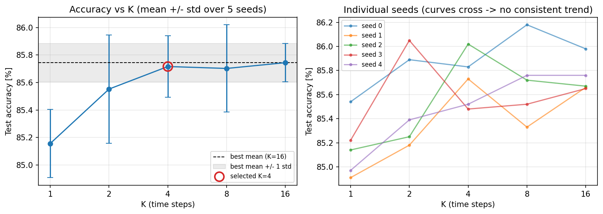
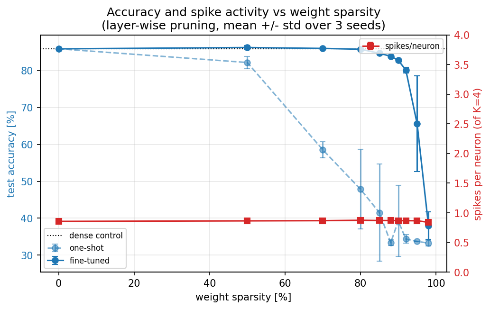

# Few-Spikes Spiking Neural Networks for Ring Counting

Energy-efficient inference with few-spikes (FS) neurons, applied to a synthetic
ring-counting task on a sparse sensor grid.

**Results:** an FS spiking MLP reaches **85.7% ± 0.2** accuracy,
within 0.3 pp of a full-precision ReLU network (**86.0% ± 0.4**), while emitting
only **0.86 spikes per neuron** out of K=4 — and **80% of its weights can be
removed at no accuracy cost**.

---

## Few-spikes neurons

FS neurons ([Stöckl & Maass, 2021](https://www.nature.com/articles/s42256-021-00311-4))
replace a continuous activation with **K discrete time steps**, at each of which
the neuron either spikes or stays silent. The output is a weighted sum of those
spikes, `out = Σ_k s_k · d_k`, which approximates a ReLU as a quantised
staircase. With geometric parameters (`T_k = d_k = h_k = 2^-k`) this is a binary
expansion of the activation value, saturating at `Σ d_k ≈ 2`.

The spike function is a step, so gradients are propagated with a **triangular
surrogate gradient** in the backward pass. Note that the surrogate is required
even with fixed FS parameters: without it, no gradient reaches the linear layers
upstream of the neuron.

**Scope note.** FS encodes *activations*, not temporal dynamics — there is no
membrane time constant and no asynchronous input processing. This is adequate
here because the inputs are static frames. Genuinely temporal models (LIF) are
listed under future work.

## The task

Counting Cherenkov-like rings on a sparse sensor grid, a problem motivated by
low-latency trigger systems in particle physics, where inference must be both
fast and energy-efficient.

| | |
|---|---|
| Input | binary hits on an octagonal grid (32×32, ~880 active sensors) |
| Output | number of rings (1–3) |
| Difficulty | overlapping rings, uniform dark noise, ~6% hit occupancy |

> Detector geometry and all parameters are deliberately generic and do not
> correspond to any specific experiment. The dataset is fully synthetic and
> reproducible from a seed — no data files are distributed or required.

**Architecture.** `1024 → 256 → 128 → 64 → 3`, with BatchNorm before each of the
three FS neurons and raw logits from the final linear layer (304,643 parameters).


## Results

### FS vs full-precision baseline

| Model | Accuracy (5 seeds) | Spikes / neuron |
|---|---|---|
| ReLU MLP (baseline) | 86.01% ± 0.36 | — |
| **FS MLP (K=4)** | **85.72% ± 0.22** | **0.86 / 4** |

Paired seeds, identical data. The 0.3 pp gap is not distinguishable from seed
variability: quantising activations into at most 4 spikes costs essentially
nothing on this task, and the network in fact uses only **21% of its spike
budget**, with ~56% of neurons silent for any given input.

### Accuracy vs K



| K | Accuracy (5 seeds) |
|---|---|
| 1 | 85.16% ± 0.25 |
| 2 | 85.55% ± 0.39 |
| 4 | 85.72% ± 0.22 |
| 8 | 85.70% ± 0.32 |
| 16 | 85.74% ± 0.14 |

Accuracy **saturates at K=4**: going from K=1 to K=4 gains 0.56 pp, while K=4, 8
and 16 are statistically indistinguishable. K=4 is selected as the smallest K
within one standard deviation of the best. Notably, K=1 — a purely binary
activation — costs only 0.6 pp.

### Pruning



| Weight sparsity | One-shot | Fine-tuned | Spikes / neuron | Silent |
|---|---|---|---|---|
| 0% (control) | 85.86% ± 0.15 | 85.85% ± 0.27 | 0.86 ± 0.00 | 56.8% |
| 50% | 82.15% ± 1.67 | 86.21% ± 0.49 | 0.86 ± 0.00 | 56.8% |
| 70% | 58.53% ± 2.22 | 85.97% ± 0.26 | 0.87 ± 0.00 | 56.8% |
| **80%** | 47.84% ± 10.79 | **85.74% ± 0.14** | 0.87 ± 0.01 | 56.4% |
| 85% | 41.51% ± 13.16 | 84.65% ± 0.20 | 0.87 ± 0.00 | 56.5% |
| 90% | 39.27% ± 9.61 | 82.74% ± 0.42 | 0.87 ± 0.01 | 56.4% |
| 92% | 34.38% ± 1.14 | 80.13% ± 0.76 | 0.87 ± 0.01 | 56.4% |
| 95% | 33.72% ± 0.00 | 65.53% ± 12.96 | 0.87 ± 0.01 | 56.3% |
| 98% | 33.28% ± 0.77 | 37.99% ± 3.71 | 0.84 ± 0.03 | 56.0% |

<sub>Layer-wise L1 magnitude pruning on linear layers only; mean ± std over 3
seeds; fine-tuning for 5 epochs at LR/10 with pruning masks kept active. The
0% row is the matched control — it receives the same extra epochs, so it is the
correct reference rather than the dense model before fine-tuning.</sub>

Three observations:

1. **80% of the weights are free.** 85.74% ± 0.14 against a control of
   85.85% ± 0.27. Degradation up to 92% is gradual and predictable; beyond 95%
   the network breaks down.
2. **Spike activity is invariant under pruning.** Across three seeds and ten
   sparsity levels, fine-tuned activity stays at 0.86–0.87 spikes/neuron with a
   ~56% silent fraction — standard deviations of 0.00–0.01. One-shot pruning
   *does* lower activity (down to ~0.75), but fine-tuning restores the original
   operating point exactly, using the surviving weights more aggressively.
   Weight sparsity and activity sparsity are therefore **independent efficiency
   axes**, and the gains compound: 20% of the weights, 21% of the spike budget.
3. **The breakdown is a transition, not a slope.** At 95% sparsity the seed
   variance explodes (±13 pp): two seeds hold at ~73%, one collapses to 50%.
   The one-shot column is bimodal in the same way — networks either survive or
   fall exactly to chance level (33.72%) — so its mean ± std should be read as
   "how many seeds collapsed", not as a continuous spread.

## Usage

```bash
python -m venv .venv && source .venv/bin/activate
pip install -r requirements.txt

python src/data/ring_synthetic.py   # generate and preview sample events
python train.py                     # train FS model, confusion matrix, activity
python experiments.py               # accuracy vs K, K x seed grid
python pruning.py                   # sparsity sweep, 3 seeds
```

All results are reproducible from fixed seeds (train seed 0, test seed 1).

## Repository structure

```
src/
├── model.py                 # FS neuron, triangular surrogate, spiking MLP
└── data/
    └── ring_synthetic.py    # synthetic ring-counting dataset (pure PyTorch)
train.py                     # canonical training run at K=4
experiments.py               # K sweep over seeds
pruning.py                   # sparsity sweep over seeds
figures/                     # generated plots
```

## Limitations and future work

- **No temporal dynamics.** FS quantises activations rather than integrating
  input over time. Adding per-hit arrival times to the generator would make the
  task genuinely event-based and justify a LIF variant.
- **The MLP discards spatial structure** by flattening the grid. A convolutional
  variant is the obvious extension for a task built on spatial patterns.
- **Structured pruning.** The sparsity reported here is unstructured, so it does
  not translate directly into wall-clock or energy savings on general hardware —
  it is a measure of redundancy, and a proxy for what dedicated neuromorphic
  hardware could exploit.
- **Learnable FS parameters.** `T`, `d`, `h` are fixed to their geometric values;
  making them trainable is a natural extension.

## References

- Stöckl & Maass, *Optimized spiking neurons can classify images with high
  accuracy through temporal coding with two spikes*, Nature Machine
  Intelligence 3, 230–238 (2021).
