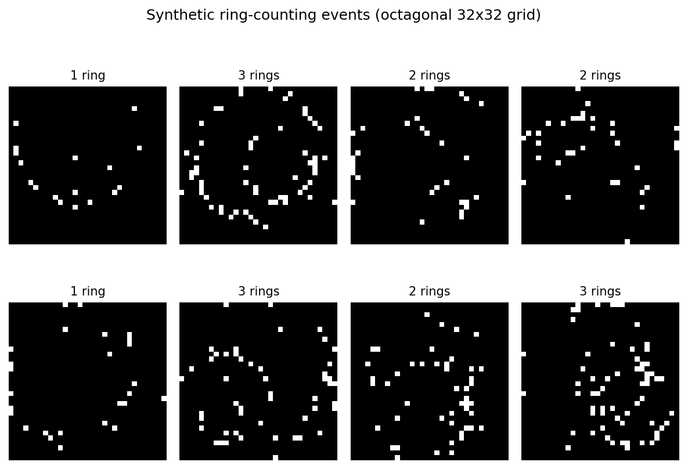
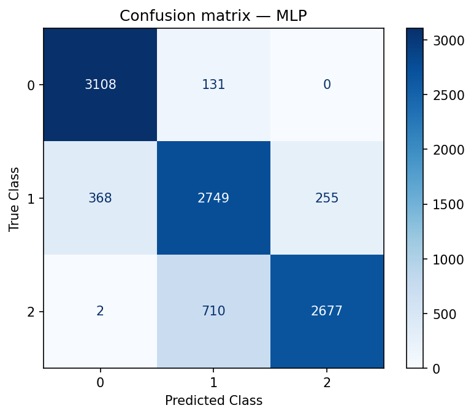
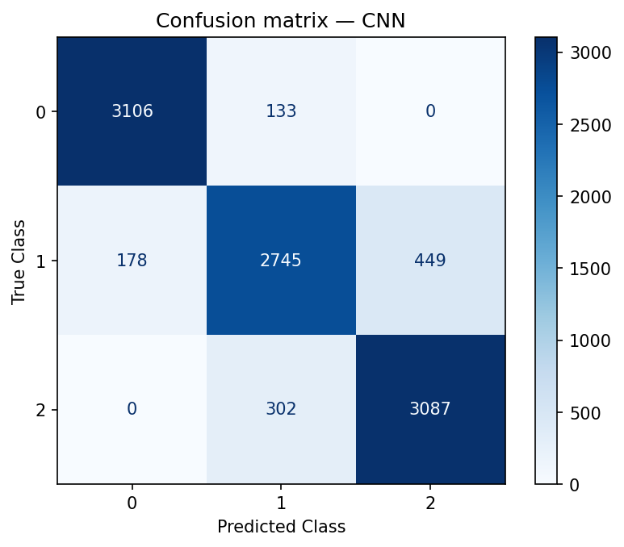
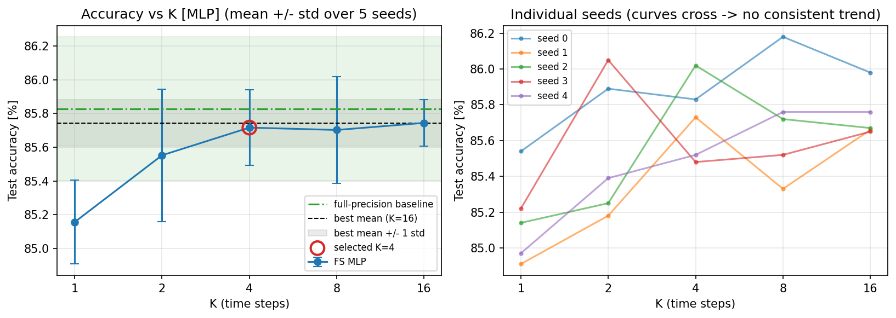
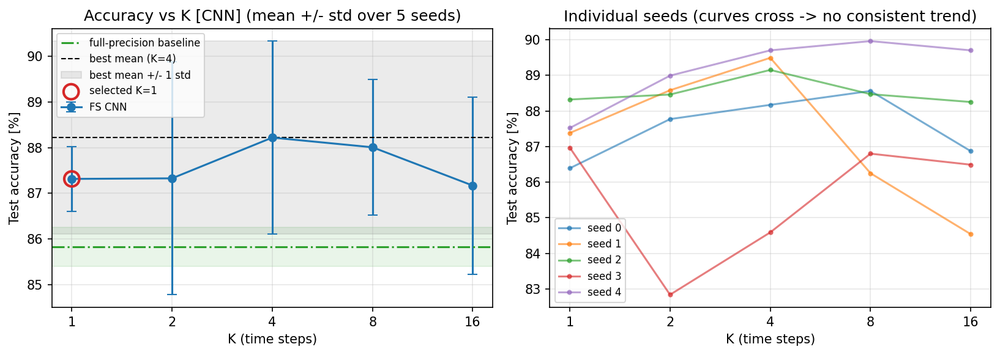
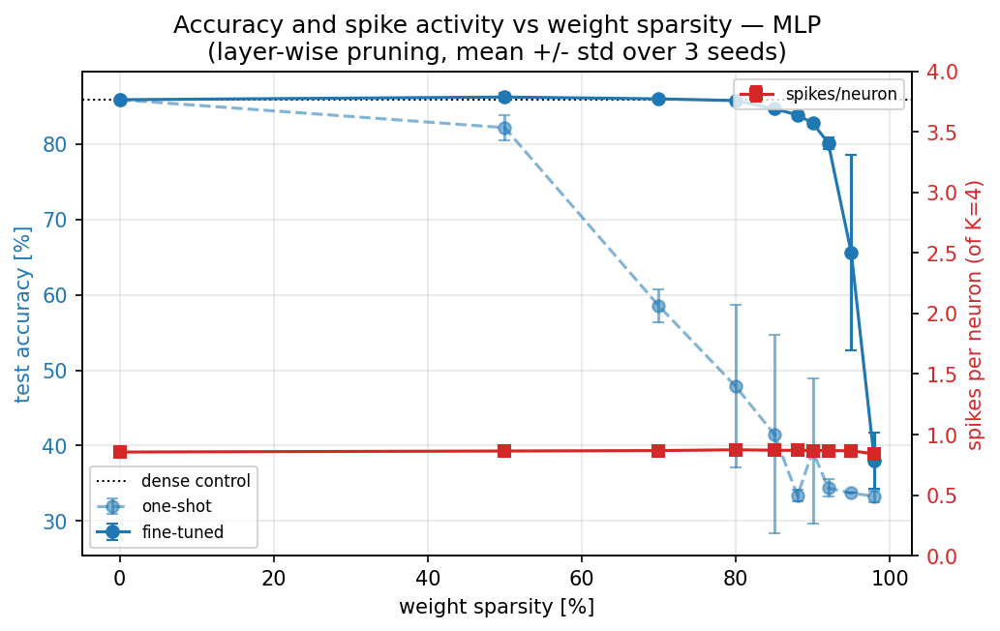
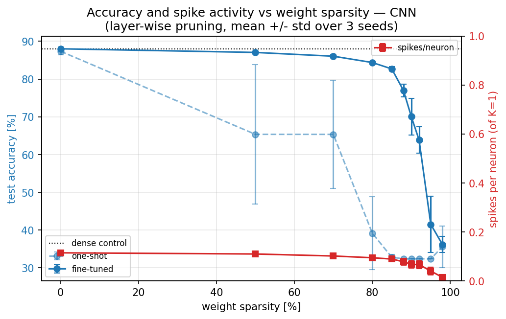

# Few-Spikes Spiking Neural Networks for Ring Counting

Energy-efficient inference with few-spikes (FS) neurons, applied to a synthetic
ring-counting task on a sparse sensor grid. Two architectures — an MLP and a CNN —
are compared against a full-precision baseline, and studied under weight pruning.

**Results in one line:** FS activations match full-precision accuracy on both
architectures. The **FS-CNN reaches 87.3% ± 0.7 with 28× fewer parameters** than
the MLP (11k vs 304k) and a single binary spike per neuron, but its activity is
far more concentrated — a trade-off that matters on neuromorphic hardware.



---

## Few-spikes neurons

FS neurons ([Stöckl & Maass, 2021](https://www.nature.com/articles/s42256-021-00311-4))
replace a continuous activation with **K discrete time steps**, at each of which
the neuron either spikes or stays silent. The output is a weighted sum of those
spikes, `out = Σ_k s_k · d_k`, approximating a ReLU as a quantised staircase.
With geometric parameters (`T_k = d_k = h_k = 2^-k`) this is a binary expansion
of the activation, saturating at `Σ d_k ≈ 2`.

The spike function is a step, so gradients use a **triangular surrogate** in the
backward pass. The surrogate is required even with fixed FS parameters: without
it, no gradient reaches the linear layers upstream of the neuron.

**Scope note.** FS encodes *activations*, not temporal dynamics — no membrane
time constant, no asynchronous input. Adequate here because inputs are static
frames. Temporal models (LIF) are listed under future work.

## The task

Counting Cherenkov-like rings on a sparse sensor grid, motivated by low-latency
trigger systems in particle physics, where inference must be fast and
energy-efficient.

<div align="center">
   
| | |
|---|---|
| Input | binary hits on an octagonal grid (32×32, ~880 active sensors) |
| Output | number of rings (1–3) |
| Difficulty | overlapping rings, uniform dark noise, ~6% hit occupancy |

</div>

> Detector geometry and all parameters are deliberately generic and do not
> correspond to any specific experiment. The dataset is fully synthetic and
> reproducible from a seed — no data files are distributed or required.

## Architectures

<div align="center">

| | Layers | Params |
|---|---|---|
| **MLP** | `1024 → 256 → 128 → 64 → 3`, BatchNorm + FS before each hidden layer | 304,643 |
| **CNN** | `Conv(1→16) → Conv(16→32) → FC(3)`, BatchNorm + FS, 2× MaxPool | 11,043 |
| **Baseline** | same MLP topology with ReLU instead of FS | 304,643 |

</div>

## Results

### FS vs full-precision, both architectures

<div align="center">

| Model | Accuracy (5 seeds) | Selected K | Params |
|---|---|---|---|
| ReLU-MLP (baseline) | 85.83% ± 0.43 | — | 304k |
| FS-MLP | 85.72% ± 0.22 | 4 | 304k |
| **FS-CNN** | **87.32% ± 0.71** | **1** | **11k** |

</div>

### Confusion matrices

<p align="center">


</p>

Errors are concentrated on adjacent ring counts (2↔3) and roughly symmetric —
both models occasionally miscount overlapping rings, but neither shows a
systematic bias. The CNN's sharper diagonal reflects its higher accuracy.


Both FS models match the full-precision baseline. The CNN's convolutional prior
suits a spatial task: it is **1.5 pp more accurate with 28× fewer parameters**.

### Accuracy vs K




<div align="center">

| K | MLP | CNN |
|---|---|---|
| 1 | 85.16% ± 0.25 | 87.32% ± **0.71** |
| 2 | 85.55% ± 0.39 | 87.33% ± 2.55 |
| 4 | 85.72% ± 0.22 | 88.22% ± 2.11 |
| 8 | 85.70% ± 0.32 | 88.01% ± 1.49 |
| 16 | 85.74% ± 0.14 | 87.17% ± 1.94 |

</div>

Accuracy is flat in K for both (spread within seed variability), so the smallest
K is selected: **K=4 for the MLP, K=1 for the CNN**. A revealing detail is the
variance: on the MLP, K=1 is the *least* stable (a binary activation with no
gradation); on the CNN, K=1 is the *most* stable (±0.71 vs ±1.5–2.5 for K≥2).
The spatial redundancy of the feature maps compensates for the coarse
single-spike activation — the opposite behaviour to the MLP.

### Pruning


<p align="center">


</p>

Layer-wise L1 magnitude pruning (linear + conv weights), 3 seeds, 5 epochs of
fine-tuning at LR/10 with masks kept active. The 0% row is the matched control.

**MLP** — robust to aggressive pruning:

<div align="center">

| Sparsity | Fine-tuned acc | Spikes/neuron | Silent |
|---|---|---|---|
| 0% (control) | 85.85% ± 0.22 | 0.86 | 57% |
| 80% | 85.74% ± 0.11 | 0.87 | 56% |
| 90% | 82.74% ± 0.35 | 0.87 | 56% |
| 95% | 65.53% ± 10.58 | 0.87 | 56% |

</div>

**CNN** — breaks down earlier:

<div align="center">

| Sparsity | Fine-tuned acc | Spikes/neuron | Silent |
|---|---|---|---|
| 0% (control) | 88.01% ± 0.35 | 0.11 | 89% |
| 50% | 87.05% ± 0.14 | 0.11 | 89% |
| 80% | 84.37% ± 0.05 | 0.09 | 91% |
| 90% | 70.07% ± 3.96 | 0.07 | 93% |

</div>

Three observations:

1. **The MLP tolerates 80% pruning at no cost; the CNN only 50%.** The MLP has
   30k redundant parameters to spare; the CNN, already at 11k, has far less
   slack, so it degrades from ~50% sparsity onward. This mirrors the higher
   seed variance seen in the K sweep: less redundancy means more sensitivity to
   both initialisation and pruning.

2. **Activity behaves oppositely under pruning in the two models.** On the MLP,
   spikes/neuron stay pinned at 0.86–0.87 at every sparsity — the network
   restores its operating point by using surviving weights more aggressively.
   On the CNN, activity *drops* with sparsity (0.11 → 0.07 → 0.01) and the
   silent fraction climbs toward 99%: pruning kills whole feature-map channels,
   which cannot be compensated the way individual MLP units can.

3. **The breakdown is a transition, not a slope.** Near the knee, seed variance
   explodes (MLP: ±10.6 pp at 95%; CNN: ±4 pp at 90%) as some seeds collapse to
   chance level while others hold. The one-shot columns are bimodal for the same
   reason, so their mean ± std should be read as "how many seeds collapsed".

### The efficiency trade-off

The two architectures optimise different axes, and neither dominates:

<div align="center">

| | Accuracy | Params | Neurons | Spikes/neuron | ≈ Spikes/sample |
|---|---|---|---|---|---|
| FS-MLP (K=4) | 85.7% | 304k | 448 | 0.86 | ~385 |
| FS-CNN (K=1) | 87.3% | 11k | 24,576 | 0.11 | ~2,700 |

</div>

The CNN wins on **accuracy and parameter count**, but its feature maps hold 55×
more neurons, so despite firing far less per neuron it emits **~7× more total
spikes per sample**. On neuromorphic hardware, where energy scales with spike
count rather than parameters, the MLP is the more frugal model. "Which is more
efficient" therefore has no single answer — it depends on whether memory or
energy is the binding constraint.

## Usage

```bash
python -m venv .venv && source .venv/bin/activate
pip install -r requirements.txt

python src/data/ring_synthetic.py            # preview sample events
python train.py --arch cnn                    # train one model (mlp|cnn|baseline)
python experiments.py --arch baseline         # baseline reference for the K sweep
python experiments.py --arch cnn --K 1        # accuracy vs K
python pruning.py --arch cnn --K 1            # sparsity sweep
```

All results reproduce from fixed seeds (train seed 0, test seed 1).

## Repository structure

```
src/
├── model.py                 # FS neuron, surrogate, FSNetwork, FSConvNetwork, ReLU baseline
└── data/
    └── ring_synthetic.py    # synthetic ring-counting dataset (pure PyTorch)
train.py                     # single training run, per architecture
experiments.py               # accuracy vs K, per architecture, with baseline line
pruning.py                   # sparsity sweep, per architecture
figures/                     # generated plots
```

## Limitations and future work

- **No temporal dynamics.** Adding per-hit arrival times to the generator would
  make the task event-based and justify a LIF variant.
- **Unstructured pruning.** The reported sparsity does not translate directly
  into wall-clock or energy savings on general hardware — it measures redundancy
  and is a proxy for what dedicated neuromorphic hardware could exploit.
  Structured (channel) pruning would be the practical next step, especially for
  the CNN, where whole channels already go silent.
- **Learnable FS parameters.** `T`, `d`, `h` are fixed to geometric values;
  making them trainable is a natural extension.

## References

- Stöckl & Maass, *Optimized spiking neurons can classify images with high
  accuracy through temporal coding with two spikes*, Nature Machine
  Intelligence 3, 230–238 (2021).
